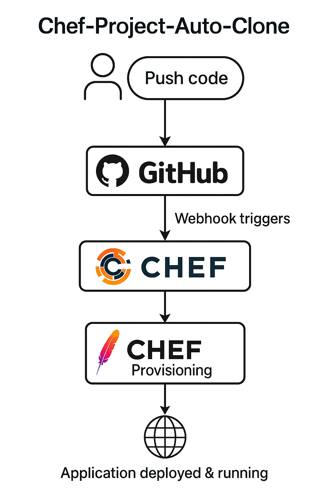

# Chef Automatic Clone Full Project, Create New Repo, Commit And Push Changes



## Step 1: Launch AWS Instance and Login

1. Log in to AWS and create an EC2 instance (Ubuntu).
2. Download and configure PuTTY for SSH access.
3. Connect to the EC2 instance using the `ubuntu` user.

---

## Step 2: Install Chef Workstation in PuTTY Terminal

1. Switch to the root user:
   ```bash
   sudo su
   ```

2. Download Chef Workstation:
   ```bash
   wget <chef_workstation_url>
   ```

3. List files to verify the download:
   ```bash
   ls
   ```

4. Install the package:
   ```bash
   dpkg -i <chef_workstation_package_path>
   ```

5. Check if Chef is installed:
   ```bash
   which chef
   ```

---

## Step 3: Create Cookbook

1. Create a `cookbooks` directory:
   ```bash
   mkdir cookbooks
   ```

2. Navigate to the directory:
   ```bash
   cd cookbooks
   ```

3. Generate a new cookbook:
   ```bash
   chef generate cookbook <cookbook_name>
   ```

---

## Step 4: Create Recipe

1. Navigate into the cookbook directory:
   ```bash
   cd <cookbook_name>
   ```

2. Generate a new recipe:
   ```bash
   chef generate recipe <recipe_name>
   ```

---

## Step 5: Install Tree

1. Update the system:
   ```bash
   apt update && apt upgrade -y
   ```

2. Install the `tree` package:
   ```bash
   apt install tree
   ```

---

## Step 6: Configure SSH for GitHub

1. Navigate to the home directory:
   ```bash
   cd ~
   ```

2. Generate an SSH key:
   ```bash
   ssh-keygen
   ```

3. Display the public key:
   ```bash
   cat ~/.ssh/id_rsa.pub
   ```

4. Add the key to your GitHub account (in GitHub → Settings → SSH and GPG keys).

5. Test the GitHub SSH connection:
   ```bash
   ssh -T git@github.com
   ```

---

## Step 7: Update the Recipe File

1. Edit the recipe file:
   ```bash
   nano cookbooks/<cookbook_name>/recipes/<recipe_name>.rb
   ```

2. Replace its contents with the following:
   ```ruby
   #
   # Cookbook:: test
   # Recipe:: new-recipe
   #

   git "/root/vardhitkansagra" do
     repository "git@github.com:vardhitkansagra/chef.git"
     revision "main"
     action :sync
   end

   file "/root/vardhitkansagra/myfile.txt" do
     content "Hello guys."
     action :create
   end

   execute 'git_add_and_commit' do
     cwd "/root/vardhitkansagra"
     command 'git add . && git commit -m "Automated commit"'
     only_if "test -n \"$(git status --porcelain)\""
   end

   execute 'checkout_feature-branch' do
     cwd "/root/vardhitkansagra"
     command 'git checkout -b feature-branch || git checkout feature-branch'
   end

   execute 'push_feature_branch' do
     cwd "/root/vardhitkansagra"
     command 'git push origin feature-branch --force'
   end

   execute 'checkout_feature-branch' do
     cwd "/root/vardhitkansagra"
     command 'git checkout -b feature-branch || git checkout feature-branch'
   end

   execute 'merge_feature_into_main' do
     cwd "/root/vardhitkansagra"
     command <<-EOH
       git checkout main &&
       git merge feature-branch
     EOH
     only_if 'git branch --list feature-branch'
   end

   execute 'push_main_branch' do
     cwd "/root/vardhitkansagra"
     command 'git push origin main'
   end
   ```

---

## Step 8: Run Chef Client to Apply Changes

1. Execute the following command to run the Chef recipe:
   ```bash
   chef-client -zr "recipe[<cookbook_name>::<recipe_name>]"
   ```
